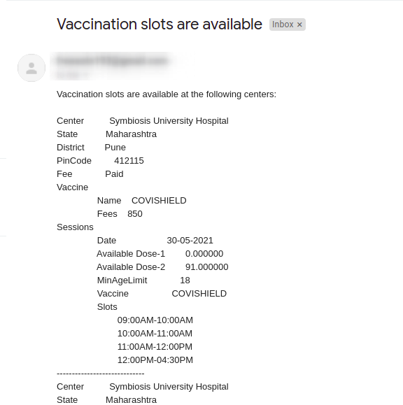

# covaccine-notifier

CoWIN Portal Vaccine availability notifier

covaccine-notifier periodically checks and sends email notifications for available slots for the next 7 days on CoWIN portal in a given area and age.

**Sample screenshot**



## Installation

### Install the pre-compiled binary

```
curl -sfL https://raw.githubusercontent.com/PrasadG193/covaccine-notifier/main/install.sh | sh
```

### Docker
```
docker pull ghcr.io/prasadg193/covaccine-notifier:v0.2.0
```

## Usage

covaccine-notifier can monitor vaccine availability either by pin-code or state and district names

```bash
$ ./covaccine-notifier --help
CoWIN Vaccine availability notifier India

Usage:
  covaccine-notifier [FLAGS] [flags]

Flags:
  -a, --age int                    Search appointment for age
  -d, --district string            Search by district name
  -e, --email string               Email address to send notifications
  -f, --fee string                 Fee preferences - free (or) paid. Default: No preference
  -h, --help                       help for covaccine-notifier
  -i, --interval int               Interval to repeat the search. Default: (60) second
  -p, --password string            Email ID password for auth
  -c, --pincode string             Search by pin code
  -s, --state string               Search by state name
  -v, --vaccine string             Vaccine preferences - covishield (or) covaxin. Default: No preference
  -n, --notifier-type string       Notifier to use - email (or) telegram. Default: email
  -t, --telegram-token string      Telegram bot API token
  -u, --telegram-username string   Telegram username 
```

**Note:** Gmail password won't work for 2FA enabled accounts. Follow [this](https://support.google.com/accounts/answer/185833?p=InvalidSecondFactor&visit_id=637554658548216477-2576856839&rd=1) guide to generate app token password and use it with `--password` arg 

**Note:** For creating telegram bot follow [this](https://core.telegram.org/bots#6-botfather). Once the new bot is created successfully, send message to the bot before starting covaccine-notifier.

## Examples

### Terminal

#### Search by State and District

```
covaccine-notifier --state Maharashtra --district Akola --age 27  --email <email-id> --password <email-password>
```

#### Search by Pin Code

```
covaccine-notifier --pincode 444002 --age 27  --email <email-id> --password <email-password>
```

#### Enable Telegram Notification

```
covaccine-notifier --pincode 444002 --age 27  --notifier-type telegram --telegram-token <tlegram-token> --telegram-username <telegram-username>
```

### Docker

```
docker run --rm -ti ghcr.io/prasadg193/covaccine-notifier:v0.2.0  --state Maharashtra --district Akola --age 27  --email <email-id> --password <email-password>
```

### Running on Kubernetes Cluster

If you are not willing to keep your terminal on all the time :smile:, you can also create a Pod on K8s cluster

```
kubectl run covaccine-notifier --image=ghcr.io/prasadg193/covaccine-notifier:v0.2.0 --command -- /covaccine-notifier --state Maharashtra --district Akola --age 27  --email <email-id> --password <email-password>
```

## Contributing

We love your input! We want to make contributing to this project as easy and transparent as possible, whether it's:
- Reporting a bug
- Discussing the current state of the code
- Submitting a fix
- Proposing new features
