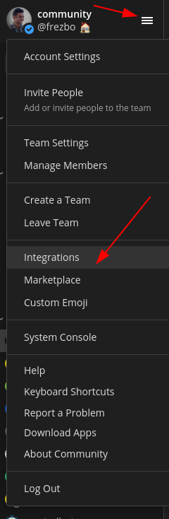
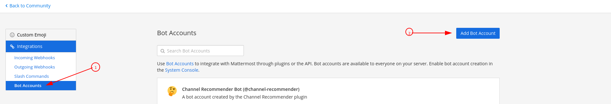
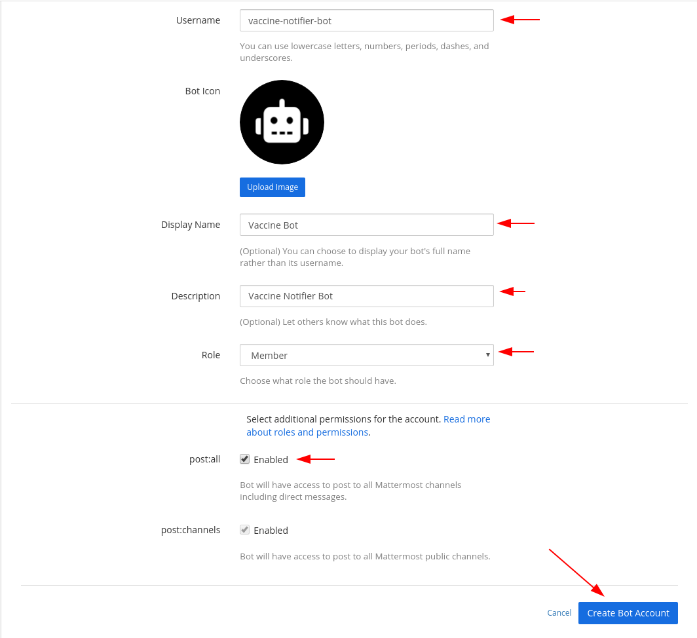
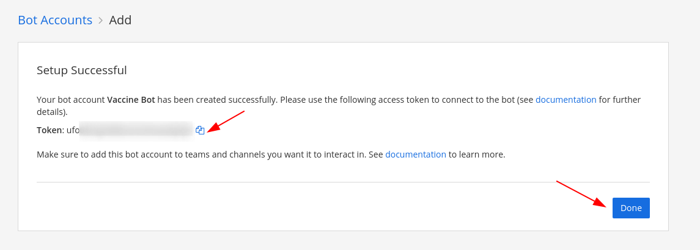

# Mattermost Intergration with Covaccine Notifier

The way to setup mattermost bot with covaccine notifier

## Step 1 - Create mattermost bot

Click on the `Settings` menu of the mattermost server and click on `Integrations`

## Step 2

In the `Integrations` page click on `Bot Accounts` and then click on `Add Bot Account`

## Step 3

In the Bot creation dialogue fill in the details for the bot and click on `Create Bot Account`

## Step 4

The next windows should show that the bot account creation was successful. Keep a note of the bot token as shown below and click on `Done`

