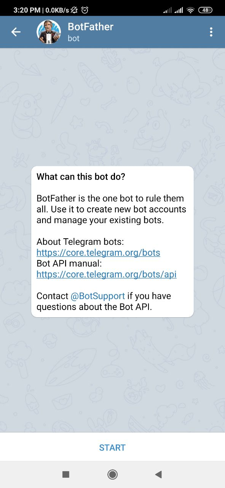
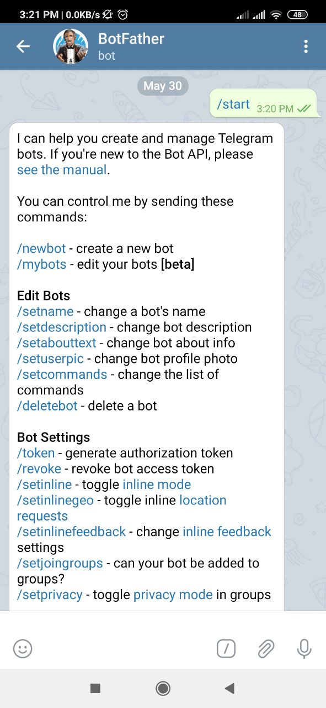
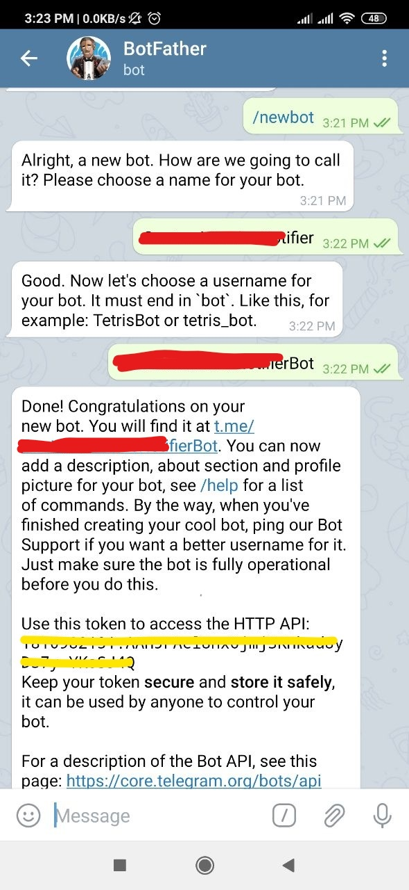
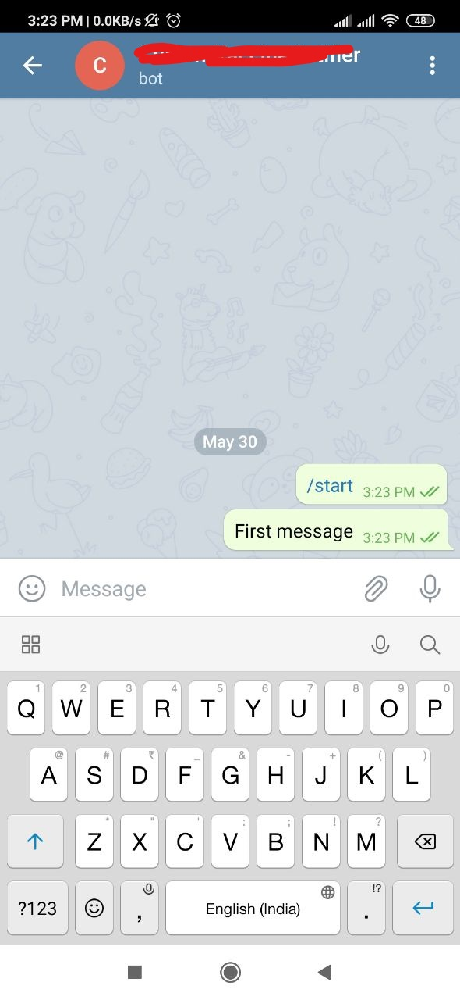
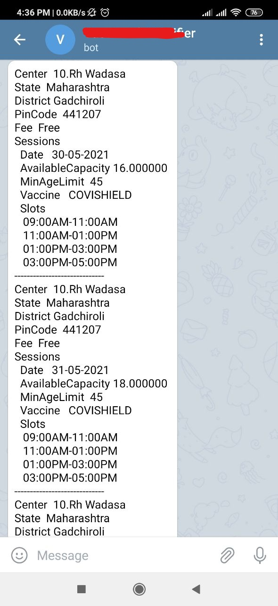

# Telegram Intergration with Covaccine Notifier

The way to setup telegram bot with covaccine notifier

* **Step 1 : Create Telegram bot**
    * Conduct search for ```@Botfather```  or you can directly open the URL https://telegram.me/botfather to start conversations with BotFather. BotFather will then introduce itself and will display a START button at the bottom for the user.

         
    
    * Once you click on the START button, BotFather will provide you with all the commands that can be used for creating a new bot, as shown in the following screenshot

         
    
    * Now, click on the link /newbot from your conversation with BotFather. With this command, BotFather will ask you to choose a name for your bot.

        

        At this point, BotFather has created your bot and has also provided a token for your bot. This token(blurred with yellow color) can be used whilst wiring up your bot with Telegram bot APIs.


* **Step 2 : Start conversation with newly created bot**

    *   To start conversation with newly created bot click on link recevied in above message 

        

    
    *   Check whether username is set for your telegram account ? 
        If not set the username.

* **Step 3 : Start covaccine-notifier with following command**

    ```
    covaccine-notifier --pincode 444002 --age 47  --notifier-type telegram --telegram-token <telegram-token> --telegram-username <telegram-username>
    ```

    Sample Screenshot

    


         


